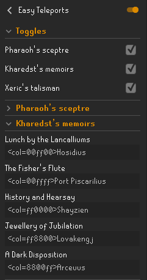

# Easy Teleports Plus
### Replaces teleport menu entries with more recognizable names for various items!

Easy Teleports Plus - An improved fork of Easy-Teleports is a RuneLite plugin that replaces difficult to remember teleport options in-game with custom names. 
Each teleport defaults to a more sensible name.

### Plugin config
Within the config, you can enable and disable whole items,
or expand the respective item's drop down menu to change the replacements.

Custom colours can used by placing `<col=HEX>` before the value,
where `HEX` is a six-hexadecimal-digit (RGB) colour code without the need for `#`

## How does it look?
For those who used earlier versions of Easy Teleports, this plugin looks and functions exactly the same. There have only been additions to the plugin so you can pick it up and go!

## Credits
This plugin was originally developed by LlemonDuck & DapperMickie and all credits to the plugin go to them.